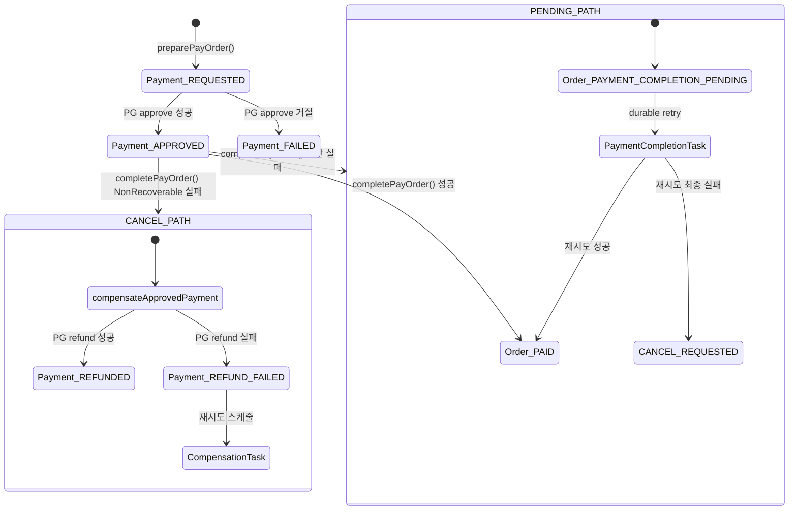
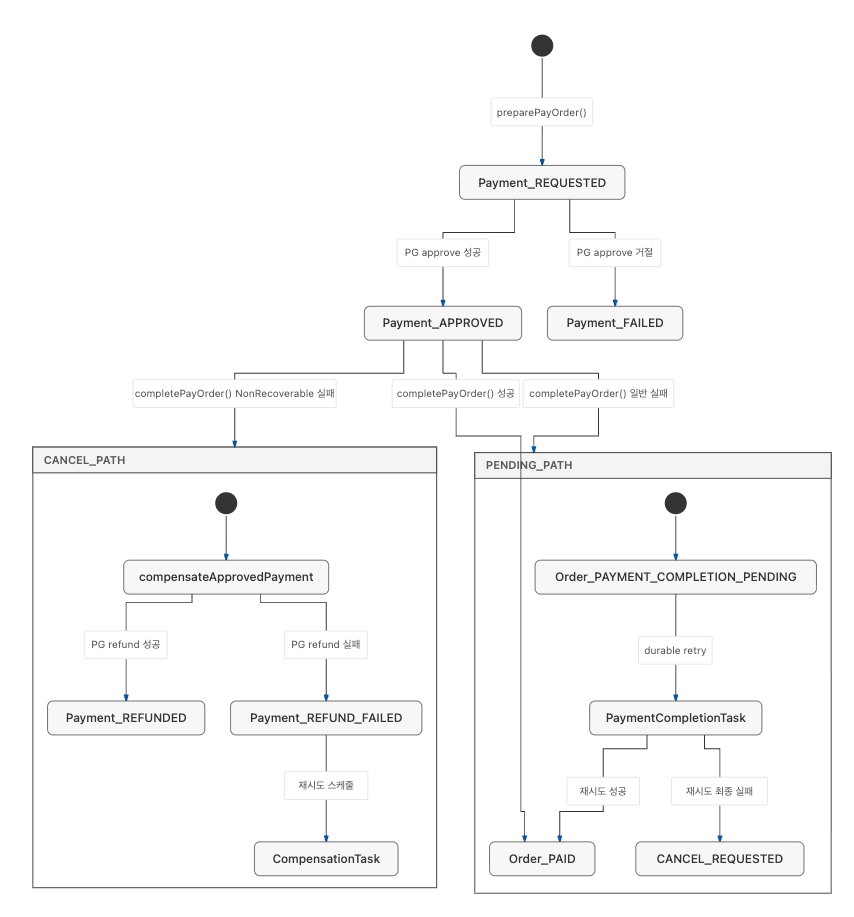

# payOrder 결제 흐름 평가 보고서

## 1. 현재 구현의 상태 머신 요약

코드를 분석한 결과, 현재 `payOrder`의 실제 흐름은 다음과 같다.





---

## 2. 유명 결제 시스템과의 비교 평가

### 2.1 토스페이먼츠 (Toss Payments)

토스페이먼츠의 공식 결제 흐름:

| 단계 | 토스페이먼츠 패턴 | 현재 구현 | 일치 |
|------|-------------------|-----------|------|
| 클라이언트 결제 요청 -> 서버 승인 호출 | 2-phase: 프론트에서 `paymentKey` 수신 -> 서버에서 `/confirm` 호출 | `preparePayOrder`로 REQUESTED 저장 후 별도로 PG approve | 구조적으로 동일 |
| 멱등성 키 기반 중복 방지 | `orderId`를 멱등성 키로 사용 | `idempotencyKey` + `replayExistingPayment` 전략 | **동일하거나 더 정교** |
| PG 승인 결과 DB 저장 | 승인 결과를 payment 레코드에 저장 | `markPaymentApproved`로 독립 트랜잭션에서 저장 | 동일 |
| 승인 후 주문 완료 실패 대응 | 웹훅 + 클라이언트 폴링으로 최종 상태 수렴 | `PAYMENT_COMPLETION_PENDING` + `PaymentCompletionTask` | **유사 (서버 사이드에서 더 적극적)** |
| PG 호출을 DB 트랜잭션 밖에서 수행 | 공식 가이드에서 권장 | 명시적으로 트랜잭션 밖에서 수행 (주석으로도 기록) | 동일 |

### 2.2 NHN 토스트 / 아임포트 (PortOne)

| 단계 | NHN/아임포트 패턴 | 현재 구현 | 일치 |
|------|-------------------|-----------|------|
| 결제 준비 -> 승인 2단계 분리 | 결제 준비 API -> 승인 API 분리 | `preparePayOrder` -> `paymentGateway.approve` | 동일 |
| 결제 금액 검증 | 서버에서 주문 금액과 PG 승인 금액 교차 검증 | `preparePayOrder`에서 `order.totalAmount`를 기준으로 Payment 생성 | **방향은 동일, PG 응답 금액 교차검증은 미구현** |
| 웹훅 기반 비동기 확인 | PG -> 가맹점 웹훅으로 상태 동기화 | Outbox 패턴 (`OrderPaidEvent`)으로 후속 처리 | **패턴적으로 대응됨** |

### 2.3 Stripe / PayPal (글로벌)

| 단계 | Stripe 패턴 | 현재 구현 | 일치 |
|------|-------------|-----------|------|
| PaymentIntent 생성 (REQUIRES_CONFIRMATION) | `PaymentIntent.create()` | `Payment.request()` (REQUESTED) | **동일한 개념** |
| Confirm 후 성공/실패 분기 | `succeeded` / `requires_action` / `canceled` | `APPROVED` / `FAILED` 분기 | 동일 |
| Idempotency Key | `Idempotency-Key` 헤더 | `idempotencyKey` 필드 + DB unique constraint | **동일** |
| Webhook으로 최종 상태 수렴 | `payment_intent.succeeded` 웹훅 | Outbox 이벤트 (`OrderPaidEvent`) | **유사 (방향이 반대: push vs pull이지만 결과적 일관성은 동일)** |
| 실패 시 자동 환불/취소 | Stripe는 자동 capture 취소 지원 | `compensateApprovedPayment`로 자동 환불 | 동일 |

---

## 3. 제시된 이상적 흐름과의 일치도 검토

### 3.1 핵심 요구사항 체크리스트

사용자가 제시한 이상적 흐름:

```
Payment.REQUESTED -> PG 승인 -> Payment.APPROVED -> Order.PAID 시도
  -> 성공: 완료
  -> 실패: PAYMENT_COMPLETION_PENDING -> 재시도
    -> 성공: 완료
    -> 실패: CANCEL_REQUESTED -> PG 취소
      -> CANCELED or CANCEL_FAILED
```

| 요구사항 | 코드 위치 | 구현 여부 | 상세 |
|----------|-----------|-----------|------|
| **Payment.REQUESTED** | [OrderPaymentTransactionService.kt:56-62](file:///Users/dongjin/dev/study/kotlin-springboot-sample/src/main/kotlin/com/example/kotlinspringbootsample/application/order/OrderPaymentTransactionService.kt#L56-L62) | **구현됨** | `Payment.request()`로 REQUESTED 상태 생성 |
| **PG 승인** | [OrderUseCase.kt:139-140](file:///Users/dongjin/dev/study/kotlin-springboot-sample/src/main/kotlin/com/example/kotlinspringbootsample/application/order/OrderUseCase.kt#L139-L140) | **구현됨** | `paymentGateway.approve()` 호출, DB 트랜잭션 밖 |
| **Payment.APPROVED** | [OrderPaymentTransactionService.kt:72-77](file:///Users/dongjin/dev/study/kotlin-springboot-sample/src/main/kotlin/com/example/kotlinspringbootsample/application/order/OrderPaymentTransactionService.kt#L72-L77) | **구현됨** | 독립 트랜잭션으로 승인 기록 확정 |
| **Order.PAID 시도 -> 성공** | [OrderPaymentTransactionService.kt:86-120](file:///Users/dongjin/dev/study/kotlin-springboot-sample/src/main/kotlin/com/example/kotlinspringbootsample/application/order/OrderPaymentTransactionService.kt#L86-L120) | **구현됨** | `completePayOrder()`에서 `order.markPaid()` + Outbox 이벤트 |
| **실패 -> PAYMENT_COMPLETION_PENDING** | [OrderPaymentTransactionService.kt:122-170](file:///Users/dongjin/dev/study/kotlin-springboot-sample/src/main/kotlin/com/example/kotlinspringbootsample/application/order/OrderPaymentTransactionService.kt#L122-L170) | **구현됨** | `markPaymentCompletionPendingAndSchedule()` |
| **고객에게 "처리 중" 표시** | [PayOrderResult.kt:25-31](file:///Users/dongjin/dev/study/kotlin-springboot-sample/src/main/kotlin/com/example/kotlinspringbootsample/application/order/result/PayOrderResult.kt#L25-L31) | **구현됨** | `PayOrderResult.processing()` + 폴링 URL 제공 |
| **재시도** | [PaymentCompletionRetryWorker.kt](file:///Users/dongjin/dev/study/kotlin-springboot-sample/src/main/kotlin/com/example/kotlinspringbootsample/infrastructure/payment/PaymentCompletionRetryWorker.kt) | **구현됨** | `PaymentCompletionTask`를 claim한 뒤 `completePayOrder()`를 durable retry |
| **재시도 성공 -> 완료** | `PaymentCompletionTask.markSuccess()` | **구현됨** | 태스크 SUCCESS 전이 |
| **복구 실패 -> 자동 환불** | [OrderUseCase.kt:181-223](file:///Users/dongjin/dev/study/kotlin-springboot-sample/src/main/kotlin/com/example/kotlinspringbootsample/application/order/OrderUseCase.kt#L181-L223) | **구현됨** | `NonRecoverablePaymentCompletionException` 또는 pending 저장 실패 시 `compensateApprovedPayment()` 호출 |
| **환불 실패 -> 운영 알림** | [CompensationService.kt:43-57](file:///Users/dongjin/dev/study/kotlin-springboot-sample/src/main/kotlin/com/example/kotlinspringbootsample/application/compensation/CompensationService.kt#L43-L57) | **부분 구현** | `CompensationTask` 등록 + 재시도, 하지만 최종 실패 시 **운영 알림(Slack/이메일 등)** 발송 로직은 미구현. 로그만 남김(`log.error`) |

### 3.2 "즉시 환불" 대신 "pending + 재시도" 패턴 채택 여부

> 승인 성공 후 주문 완료 실패 = **즉시 환불**이 아니라,
> pending 상태 저장 + 재시도 + 고객에게 처리 중 표시 + 복구 실패 시 자동 환불 + 환불 실패 시 운영 알림

| 항목 | 구현 여부 | 근거 코드 |
|------|-----------|-----------|
| pending 상태 저장 | **구현됨** | `OrderStatus.PAYMENT_COMPLETION_PENDING` + `Order.markPaymentCompletionPending()` |
| 재시도 (durable retry) | **구현됨** | `PaymentCompletionTask` + `PaymentCompletionRetryWorker`, `markRetry()`, `nextAttemptAt` |
| 고객에게 처리 중 표시 | **구현됨** | `PayOrderResult.processing()` 응답 + `pollingUrl` 제공 |
| 복구 실패 시 자동 환불 | **구현됨** | `NonRecoverablePaymentCompletionException` 경로에서 `compensateApprovedPayment()` |
| 환불 실패 시 운영 알림 | **미구현** | `CompensationService.retryPgRefund()`에서 MAX_RETRY 초과 시 `log.error`만 남기고 별도 알림 없음 |

---

## 4. 강점 분석

### 4.1 트랜잭션 분리 설계 (매우 우수)

```
preparePayOrder()    [TX-1] -- Payment.REQUESTED 저장, 커밋
paymentGateway.approve()     -- DB 트랜잭션 없음
markPaymentApproved() [TX-2] -- Payment.APPROVED 기록, 커밋
completePayOrder()   [TX-3] -- Order.PAID + Outbox 이벤트, 커밋
```

PG 호출(외부 HTTP)을 DB 트랜잭션 밖에서 수행하는 것은 토스페이먼츠, Stripe 등 모든 주요 결제 시스템이 권장하는 핵심 패턴이다. 이를 통해:
- DB 커넥션 점유 시간 최소화
- PG 타임아웃으로 인한 DB 락 전파 방지
- 롤백 시 외부 상태와의 불일치 방지

### 4.2 멱등성 처리 (매우 정교)

[replayExistingPayment()](file:///Users/dongjin/dev/study/kotlin-springboot-sample/src/main/kotlin/com/example/kotlinspringbootsample/application/order/OrderPaymentTransactionService.kt#L279-L305)는 Payment의 모든 상태(`REQUESTED`, `APPROVED`, `FAILED`, `REFUNDED`, `REFUND_FAILED`)에 대해 적절한 replay 응답을 반환한다. 특히 `APPROVED` 상태에서 주문이 아직 완료되지 않은 경우 `markPaymentCompletionPendingAndSchedule`로 복구를 시도하는 것은 Stripe의 `PaymentIntent` 복구 패턴과 동일한 수준이다.

### 4.3 다단계 실패 복구 (우수)

```kotlin
// 5-B. 복구 가능한 실패 -> pending + retry
val pendingOrder = try {
    orderPaymentTransactionService.markPaymentCompletionPendingAndSchedule(...)
} catch (pendingFailure: Exception) {
    // pending 기록 자체가 실패하면 -> 환불 보상으로 안전하게 닫기
    compensationService.compensateApprovedPayment(...)
    return PayOrderResult.canceling(...)
}
```

pending 기록 실패까지 대비한 이중 안전장치는 프로덕션 레벨의 방어적 프로그래밍이다.

### 4.4 Payment Audit Trail (우수)

[PaymentHistory](file:///Users/dongjin/dev/study/kotlin-springboot-sample/src/main/kotlin/com/example/kotlinspringbootsample/domain/payment/PaymentHistory.kt) 엔티티와 `payment_histories` 테이블로 모든 상태 전이를 기록하고 있어, 결제 분쟁이나 운영 이슈 발생 시 추적이 가능하다.

### 4.5 Optimistic Locking (적절)

`Payment`와 `Order` 모두 `@Version` 필드로 낙관적 락을 사용하고, `requireOrderForUpdate`에서는 `SELECT ... FOR UPDATE` 비관적 락도 병행하여 동시 결제 요청에 대한 정합성을 보장한다.

---

## 5. 개선이 필요한 부분

### 5.1 환불 최종 실패 시 운영 알림 부재 (중요도: 높음)

**현재**: [CompensationService.kt:107-109](file:///Users/dongjin/dev/study/kotlin-springboot-sample/src/main/kotlin/com/example/kotlinspringbootsample/application/compensation/CompensationService.kt#L107-L109)에서 `log.error`만 남기고 있다.

**개선 방향**: `MAX_RETRY` 초과 시 Slack/PagerDuty/이메일 등으로 운영팀 알림을 발송해야 한다. 이는 사용자가 제시한 "환불 실패 시 운영 알림" 요구사항의 유일한 미충족 항목이다.

```kotlin
// 개선 예시
if (nextRetry >= MAX_RETRY) {
    compensationTransactionService.recordTaskRefundFailure(...)
    notificationService.notifyOps(  // <-- 추가 필요
        "결제 환불 최종 실패: paymentId=$paymentId, taskId=$taskId"
    )
    log.error(...)
}
```

### 5.2 PG 승인 금액 교차 검증 부재 (중요도: 중간)

**현재**: PG `approve()` 결과에서 `paymentKey`와 `approvedAt`만 사용하고 있으며, 실제 승인된 금액과 주문 금액의 일치 여부를 검증하지 않는다.

**근거**: 토스페이먼츠 공식 가이드에서는 "가맹점 서버에서 결제 금액과 주문 금액이 같은지 반드시 확인"하도록 권장한다. 금액 위변조 공격 방어를 위해 필수적이다.

### 5.3 PaymentCompletionTask Worker 운영 관측성 보강 (중요도: 중간)

**현재**: [PaymentCompletionRetryWorker](file:///Users/dongjin/dev/study/kotlin-springboot-sample/src/main/kotlin/com/example/kotlinspringbootsample/infrastructure/payment/PaymentCompletionRetryWorker.kt)가 `PaymentCompletionTask`를 폴링하여 `completePayOrder()`를 재시도한다. 재시도 한도 초과 또는 복구 불가 실패 시 `compensateApprovedPayment()`로 환불 보상까지 연결된다.

> 다음 단계에서는 pending task 적체량, retry 횟수, 최종 실패 건수를 메트릭으로 노출하고, 다중 인스턴스 환경에서 claim lease와 `SKIP LOCKED` 동작을 운영 DB 기준으로 검증하는 것이 좋다.

### 5.4 PG 승인 audit 저장 실패 시의 즉시 환불 (중요도: 낮음)

[OrderUseCase.kt:150-168](file:///Users/dongjin/dev/study/kotlin-springboot-sample/src/main/kotlin/com/example/kotlinspringbootsample/application/order/OrderUseCase.kt#L150-L168)에서 `markPaymentApproved` 실패 시 즉시 환불을 수행한다. 이는 3-B 단계에서만 발생하는 것이므로 아직 Order.PAID 시도 전이라 pending 패턴 대신 즉시 환불이 적절하다. 다만, 이 경우에도 환불 실패 가능성이 있으므로 `compensateApprovedPayment`의 `CompensationOutcome.Scheduled` 경로가 동작하는지 확인이 필요하다.

---

## 6. 제시된 이상적 상태 머신과의 매핑

```
제시된 흐름                             현재 구현의 대응
──────────────────────────────────────────────────────────────────────
Payment.REQUESTED                    -> Payment.request() [TX-1]
-> PG 승인                           -> paymentGateway.approve() [트랜잭션 외부]
-> Payment.APPROVED                  -> markPaymentApproved() [TX-2]
-> Order.PAID 시도                   -> completePayOrder() [TX-3]
  -> 성공: 완료                      -> PayOrderResult.paid()
  -> 실패: PAYMENT_COMPLETION_PENDING -> markPaymentCompletionPendingAndSchedule()
    -> 재시도                        -> PaymentCompletionTask (PENDING)
      -> 성공: 완료                  -> PaymentCompletionTask.markSuccess()
      -> 실패: CANCEL_REQUESTED      -> NonRecoverablePaymentCompletionException
        -> PG 취소                   -> compensateApprovedPayment()
          -> CANCELED                -> Payment.REFUNDED
          -> CANCEL_FAILED           -> Payment.REFUND_FAILED + CompensationTask
```

> **결론**: 제시된 이상적 상태 머신의 모든 주요 경로가 현재 구현에 존재한다. 유일한 gap은 "환불 최종 실패 시 운영 알림"이다.

---

## 7. 종합 평가

| 평가 항목 | 점수 | 비고 |
|-----------|------|------|
| 토스페이먼츠 패턴 준수 | 9/10 | PG 승인 금액 교차 검증만 미구현 |
| Stripe 패턴 유사도 | 9/10 | PaymentIntent -> Confirm -> Webhook 패턴과 구조적으로 동일 |
| 멱등성 | 10/10 | 모든 Payment 상태에 대한 replay 처리 완비 |
| 트랜잭션 분리 | 10/10 | PG 호출을 DB TX 밖에서 수행, TX 단위가 짧고 독립적 |
| Pending + 재시도 패턴 | 9/10 | Task 엔티티/상태 머신/Worker 구현, 운영 메트릭 보강 여지 |
| 고객 응답 다양화 | 10/10 | paid / processing / canceling / canceled 4가지 응답 |
| 환불 보상 | 8/10 | 자동 환불 + 재시도 구현, 최종 실패 알림만 미구현 |
| Audit Trail | 10/10 | PaymentHistory로 모든 전이 기록 |
| **종합** | **9.4/10** | **프로덕션 수준의 결제 흐름** |

---

## 8. 후속 질문 (Next Questions)

1. **운영 알림 연동**: Slack, PagerDuty 등의 알림 인프라가 이미 존재하는지? `CompensationService`의 MAX_RETRY 초과 시 연동할 계획이 있는지?
2. **PG 승인 금액 검증**: `ApproveResult`에 승인 금액 필드를 추가하여 교차 검증을 구현할 의향이 있는지?
3. **분산 환경 대응**: 다중 인스턴스 배포 시 `PaymentCompletionTask`와 `CompensationTask`의 중복 실행을 claim lease, `SKIP LOCKED`, 분산 락 중 무엇으로 운영 검증할지?
4. **운영 관측성**: payment completion pending 적체량, retry 횟수, compensation 진입 건수를 어떤 메트릭/대시보드로 볼지?
